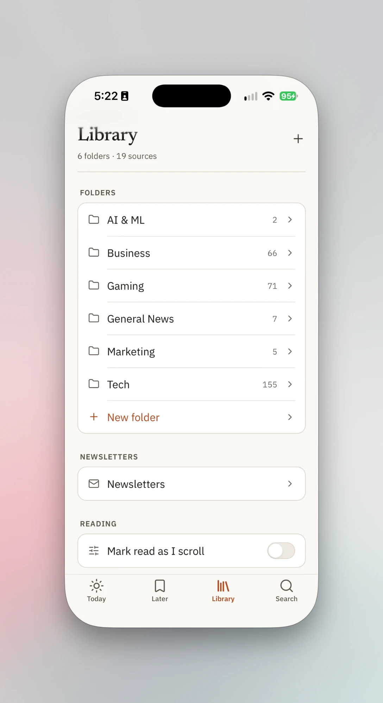

# Abovefold

[](LICENSE)
[](https://buymeacoffee.com/olivierbbommel)

A self-hosted news reader that reads everything and shows you what matters.

Abovefold follows your RSS feeds, subreddits, YouTube channels and email
newsletters, summarises every story, folds duplicate coverage into one item,
and ranks what is left by what you actually read. The front page is balanced
across your folders, so one busy topic cannot bury the rest.

It is built on [Miniflux](https://miniflux.app) for fetching, a small Python
worker for the AI parts, and a fast, installable web app designed to feel at
home on a phone.

<p align="center">
  
  
  
  
</p>

## What it does

- **A ranked, balanced Today.** Stories are scored on relevance to your
  reading, novelty and recency, then balanced so no folder takes more than its
  share of the top of the list.
- **Summaries and duplicate folding.** Each story gets a short summary; the
  same news from five sites becomes one item that says "also covered by 4".
- **Learns from what you read.** Opening a story, how long you stay and what
  you save all feed ranking. Nothing leaves your server except the
  text sent to the model provider for summaries and embeddings.
- **One box to add anything.** Type "The Atlantic", paste a URL, `r/rust`, a
  YouTube `@handle`, or an email newsletter. It finds the feed, previews its
  last 30 days and suggests a folder.
- **Sources from your own reading.** A list of sites your feeds keep linking
  to, ranked by how often and how much you open them. No editorial picks.
- **Newsletters by email** (optional, needs your own domain): every newsletter
  gets its own address and lands in a Newsletters section.
- **Reader apps still work.** Miniflux's Fever and Google Reader APIs are
  available for apps like Reeder and NetNewsWire.
- **Private by default.** Single user, images proxied, no hotlinking, no
  third-party favicon services, no analytics.

## Quick start

You need Docker, a machine that can stay on (a small VPS is fine), and an
[OpenRouter](https://openrouter.ai) API key.

```bash
git clone https://github.com/olivierbbommel/abovefold.git
cd abovefold
./scripts/setup.sh
```

The script generates every secret, starts the stack, and prints your password.
Then put HTTPS in front of `127.0.0.1:8090`; [docs/deploying.md](docs/deploying.md)
covers Cloudflare Tunnel and Caddy, updating, backups and troubleshooting.

## Costs

Roughly 2 US cents per 100 articles with the default models
(`openai/text-embedding-3-small`, `google/gemini-2.5-flash-lite`). A monthly
cap, 5 USD by default, stops paid calls when reached; feeds keep updating.

## How it fits together

```
Miniflux  --->  Postgres + pgvector  <---  worker (Python)
 fetches         one database,              extract, prefilter, embed,
 feeds           two schemas                dedupe, summarise, score
                      ^
                      |
                 web (Next.js)  <---  you, via HTTPS
```

Miniflux owns its own schema and is only changed through its REST API; the app
keeps everything else in an `app` schema.

## Documentation

- [Deploying](docs/deploying.md): install, HTTPS, updates, backups, costs
- [Newsletters by email](docs/newsletters.md): optional, needs your own domain
- [Security](SECURITY.md): design notes and how to report a vulnerability
- [.env.example](.env.example): every setting, explained

## Development

```bash
cd web && npm ci && npx tsc --noEmit -p . && npm run build
for t in lib/*.test.ts; do node --experimental-strip-types "$t"; done
cd ../worker && pip install -r requirements.txt pytest && python -m pytest
```

Issues and pull requests are welcome. Please keep changes focused, and include
a test when you fix a bug.

## Support

Abovefold is free and always will be. If it saves you time, you can buy me a
coffee:

<a href="https://buymeacoffee.com/olivierbbommel"></a>

## License

MIT, see [LICENSE](LICENSE). Miniflux is Apache-2.0 and runs unmodified in its
own container; see [NOTICE](NOTICE).
